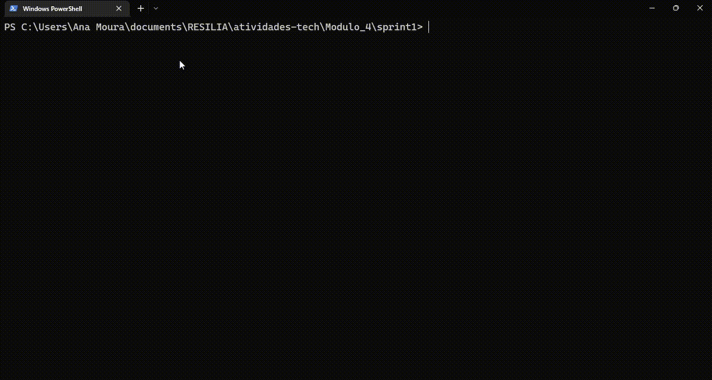

# Ordenando propriedades CSS pelo terminal

## 🚴 Descrição do exercício:

Nessa primeira sprint do módulo 4, a atividade pedia para criar uma ferramenta no terminal que auxilia desenvolvedores no dia a dia com CSS.

Foi usado o Node para montar um código que vai receber uma lista de propriedades de CSS (ex: background-color, font-size, text-align) e vai devolver essa lista ordenada de A-Z.

Isso é legal porque ordenar o CSS ajuda a encontrar mais rápido a propriedade que precisamos alterar.

## 📝 Requisitos:

O código deve rodar em um laço que vai receber propriedades até
a pessoa digitar a palavra “SAIR”, quando isso acontecer vai ser
impresso no terminal a lista das propriedades ordenadas de A-Z
uma em cada linha.

No caso, optei por exibir a mensagem <em>"Deseja continuar? Sim: [S] Não: [N]"</em>, em que a pessoa usuária digita <strong>S</strong> para <strong>"sim"</strong>", e continua, e <strong>N</strong> para <strong>"não"</strong>, saindo do loop.

## 📚 Bibliotecas NPM usadas:
* [prompt-sync](https://www.npmjs.com/package/prompt-sync)
* [chalk](https://www.npmjs.com/package/chalk)
